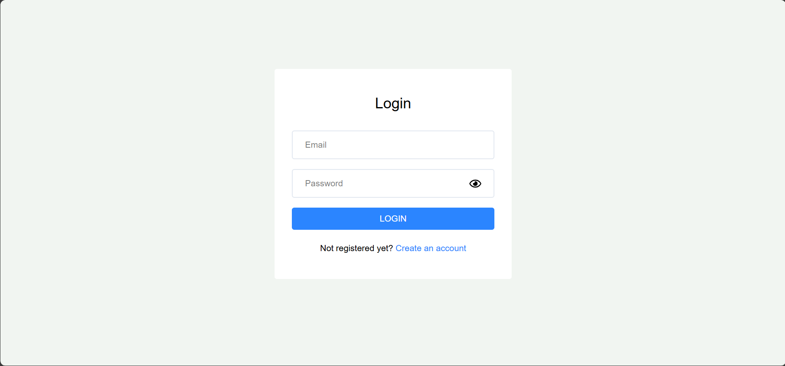
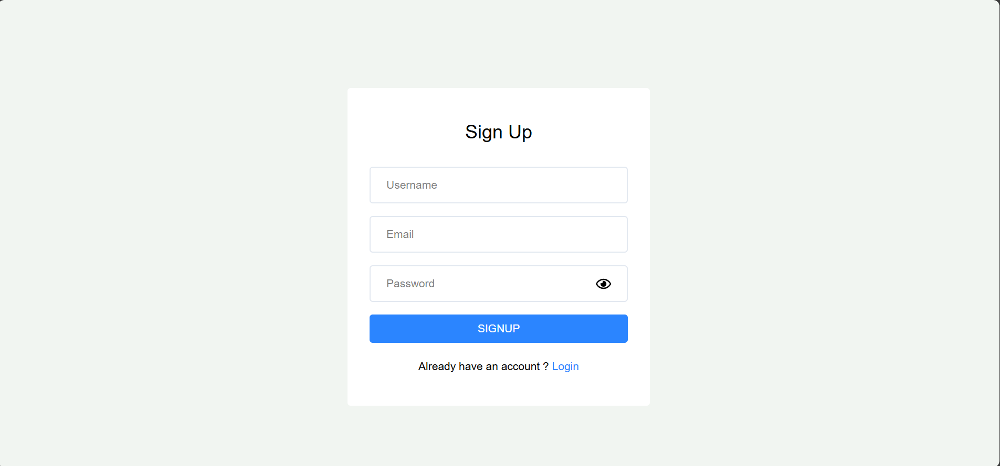
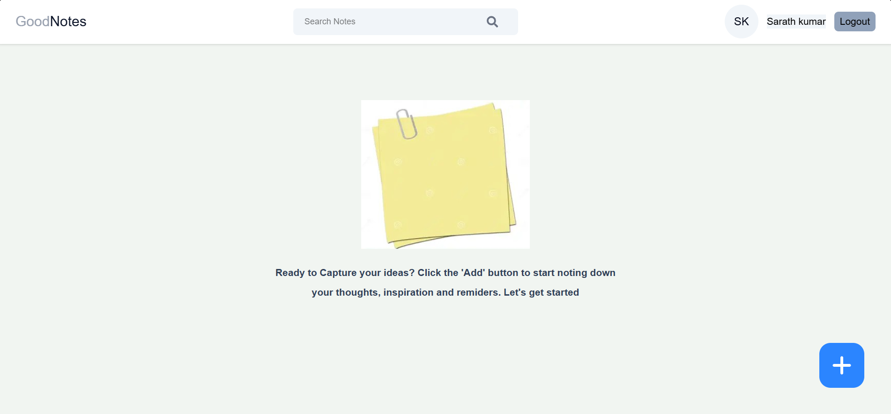
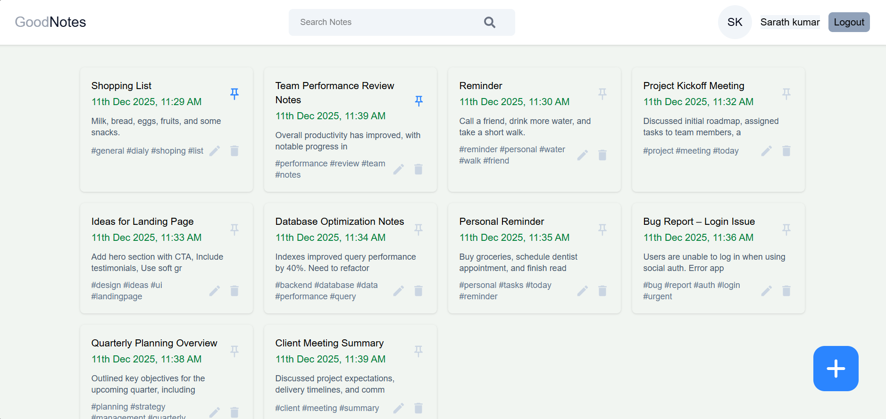
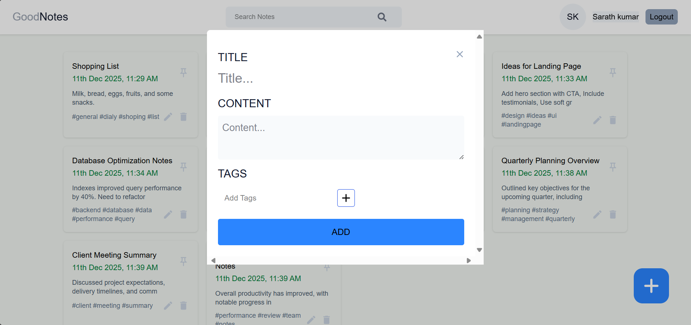
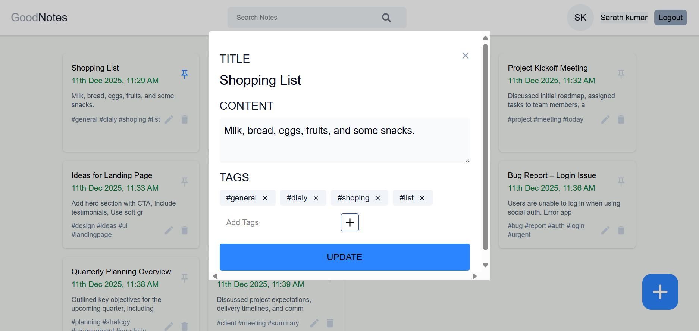
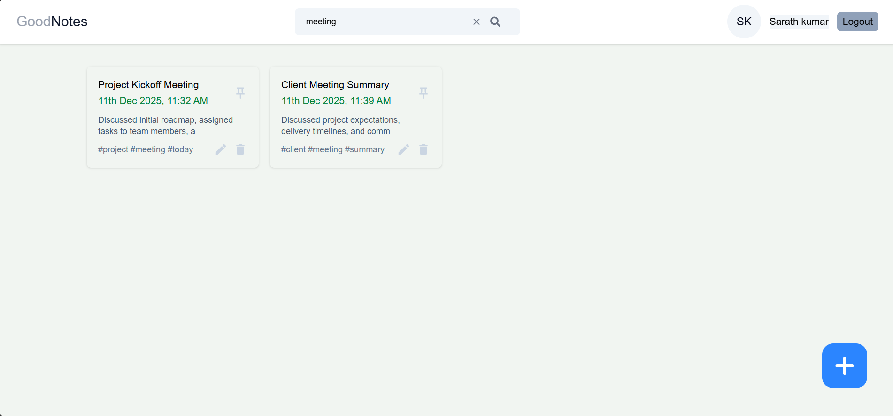
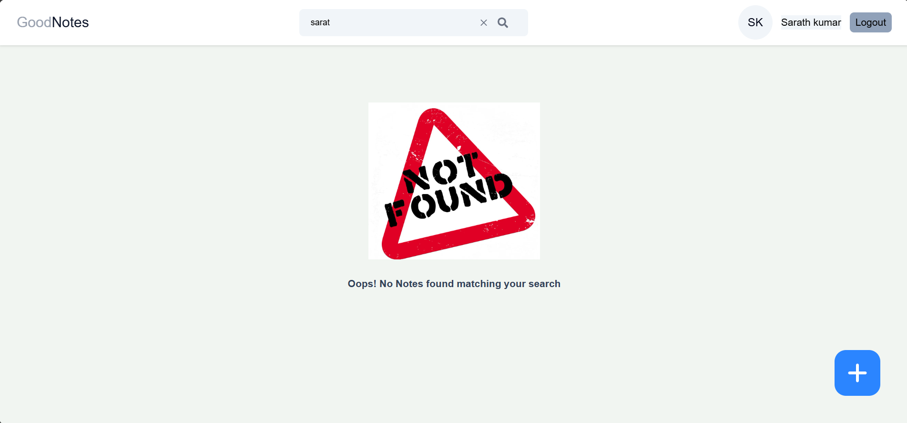

[](https://github.com/bantupallisarath7/Notes-Web-Application)

# 📝 Notes Application

## 📖 Overview
The **Notes Application** is a simple and efficient **MERN stack** project that allows users to securely manage their personal notes.  
It includes **Login & Signup authentication**, along with full **CRUD operations** and a **search feature** for easy note management.

The application supports:
- **User**: Can sign up, log in, create notes, update notes, delete notes, and search notes.

---

## 🛠 Tech Stack
- **Frontend**: React + Tailwind CSS (or your chosen styling)
- **Backend**: Node.js + Express.js
- **Database**: MongoDB
- **Authentication**: JWT-based user authentication

---

## 📂 Project Structure

### 🌐 Frontend (`/frontend`)
```
frontend/
├── node_modules/
├── public/
├── redux/
│   ├── user/
│   └── store.js
├── src/
│   ├── assets/
│   ├── Components/
│   │   ├── Cards/
│   │   │   ├── EmptyCards.jsx
│   │   │   ├── NoteCard.jsx
│   │   │   └── ProfileInfo.jsx
│   │   ├── Input/
│   │   │   ├── PasswordInput.jsx
│   │   │   └── TagInput.jsx
│   │   ├── SearchBar/
│   │   │   └── SearchBar.jsx
│   │   └── Navbar.jsx
│   ├── Pages/
│   │   └── Home/
│   │       ├── AddEditNotes.jsx
│   │       └── Home.jsx
│   ├── Login/
│   │   └── Login.jsx
│   ├── Signup/
│   │   └── Signup.jsx
│   ├── utils/
│   │   └── helper.js
│   ├── App.css
│   ├── App.jsx
│   ├── index.css
│   ├── main.jsx
├── eslint.config.js
├── index.html
├── package-lock.json
├── package.json
└── vite.config.js
```

### 🔧 Backend (`/backend`)
```backend/
├── Controllers/
│   ├── createNote.js
│   ├── createUser.js
│   ├── deleteNote.js
│   ├── getAllNotes.js
│   ├── getUser.js
│   ├── searchNotes.js
│   ├── signOut.js
│   ├── updateIsPinned.js
│   └── updateNote.js
├── Models/
│   ├── Note.js
│   └── User.js
├── Routes/
│   └── routes.js
├── utils/
│   ├── error.js
│   └── verifyToken.js
├── node_modules/
├── .env
├── package-lock.json
├── package.json
└── server.js

```

---

## 🚀 Features

### 👤 User
- Create an account (Signup)
- Log in securely using JWT authentication
- Create new notes
- Update existing notes
- Delete notes
- Search notes instantly
- Pin notes
- View all notes in a clean dashboard

---

## 🧠 Notes Lifecycle

1. **User logs in** → Access to notes dashboard  
2. **User creates a note** → Saved to database  
3. **User updates a note** → Changes reflected immediately  
4. **User deletes a note** → Removed permanently  
5. **User searches notes** → Real-time filtering
6. **User pins a note**  → Pin note

---

## ⚙️ Installation

```bash
# Clone the repository
git clone https://github.com/your-username/your-notes-app-repo.git
```

### Backend Setup
```bash
cd backend
npm install
npm run dev
```

### Frontend Setup
```bash
cd ../frontend
npm install
npm run dev
```

---

## 📸 Screenshots

## Sign In


## Sign Up


## Home Page


## After Adding Notes


## Add Notes


## Update Notes


## Search Notes


## Empty Search


---
